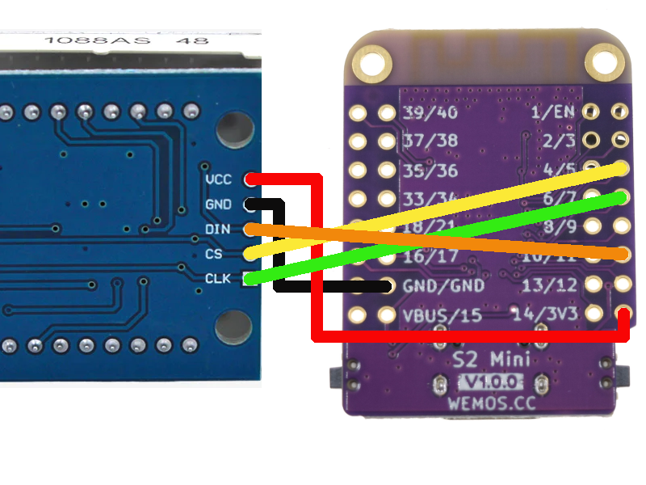
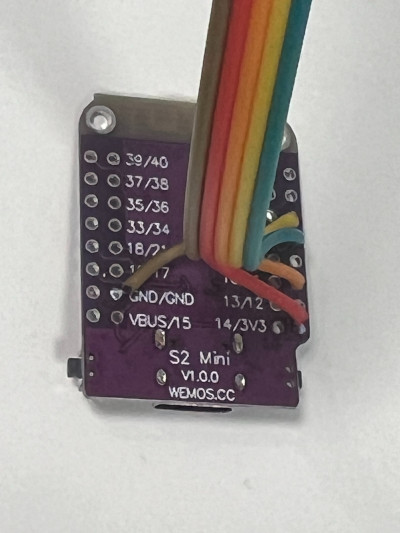
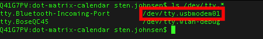

# esp-temp-and pressure

Sampling and displaying temperature and pressure through a standard DS18x20 device and a ADS1x15 I2C device, posting it to a homeassistant through mqtt server.

## Getting started

For this project to work, you need the following:

- [Wemos D1 Mini ESP8266](https://elkim.no/produkt/d1-mini-nodemcu-4m-bytes-lua-wifi-development-board-esp8266-wemos-type/)
- [DS18B20 Watertight temp sensor](https://elkim.no/produkt/ds18b20-vanntett-digital-temperatursensor/)
- [ADS1115 16 Bit I2C Module](https://www.google.com/search?q=ADS1115+16+Bit+I2C+Module&udm=3)
- [Pressure Sensor G1/2 10Bar 5V DC 3-Wire](https://www.google.com/search?q=Pressure+Sensor+G1/2+10Bar+5V+DC+3-Wire&udm=3)
- 3D printed [box](https://makerworld.com/en/models/171388#profileId-265969)

### Wiring

Connect the dot matrix module to the S2 mini:

| S2 mini | S3 mini | Dot Matrix | signal      |
|---------|---------|------------|-------------|
| 3V3     | 3V3     | VCC        | Power       |
| GND     | GND     | GND        | Ground      |
| GPIO 11 | GPIO 11 | DIN        | Data        |
| GPIO 5  | GPIO 5  | CS         | Chip select |
| GPIO 7  | GPIO 12 | CLK        | Clock       |




### Install tools for building and loading binary

Install the basic tools for working with this repo:
```bash
brew install pipx picocom wget unzip
pipx install esptool rshell freezefs vfs_merge 
```


### Set up repo and build your own firmware

Clone and extract this repo and move into the repository root:

```bash
git clone https://github.com/stenjo/dot-matrix-calendar.git
cd dot-matrix-calendar
```

Initialize the micropython repo and run prepare script:

```bash
git submodule update --init lib/micropython
make prepare
```

Check what usb port the board is connected to by running the following command:

```bash
ls /dev/cu.*
```

You should get a listing of connected usb devices like:

Make a note of the usb name - you are going to use this for the erasing a loading of the board flash.

Erase the flash specifying the port found in the list above:

```bash
make erase
```

To do all of removing old files, erasing the target flash, building the firmware and downloading it to the target:

```bash
make clean erase all deploy
```

Reset the board by pressing the reset button.
Add python files to the board by using rshell:

```bash
rshell rsync ../../src /pyboard
```

Within rshell, run the command to copy `boot.py` and `main.py` to the board

```bash
rsync src /pyboard
```

Open pycom to view runtime info and get the REPL prompt (this is for S3 devices)

```bash
picocom /dev/cu.usbmodem1234561 --b 115200
```

If you do not get the REPL prompt (` >>> `), just press Control-C

You can also do both the above steps this via make file:

```bash
make copy mon
```

```bash
make BOARD=LOLIN_S2_MINI PORT=/dev/tty.usbmodem01 -C lib/micropython/ports/esp32 FROZEN_MANIFEST=/Users/sten/git/temp-and-pressure-sensor/manifest.py  all deploy
```

### Build binary

## Dependencies
| tool            | reference        |
|-----------------|------------------|
| `esptool.py`    | https://docs.espressif.com/projects/esptool/en/latest/esp32/ |


## Building and deploying for ESP8266
```bash
docker run --rm -v $HOME:$HOME -u $UID -w $PWD larsks/esp-open-sdk make clean prepare all PYTHON=python3
make erase deploy copy mon
```


## Credits

[Micropython Captive Portal](https://github.com/amora-labs/micropython-captive-portal.git)
[Micropython Wifi Manager](https://github.com/ferreira-igor/micropython-wifi_manager)
[Micropyton ADS1x15 driver](https://github.com/robert-hh/ads1x15)