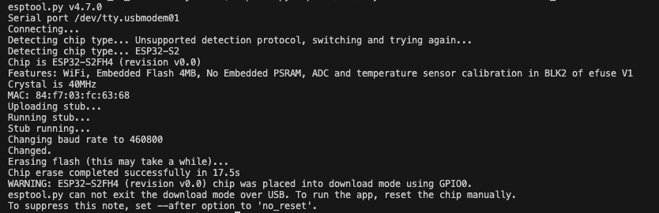

# dot-matrix-calendar

Displaying a marquee list of events from one or more ics calendar feeds on an ESP32 based Lolin S2 Mini and a max7219-driven dot matrix led using Micropython. The firmware is set up with a captive portal, enabling 
connection to a wifi network with password.
Application allows for several calendar feeds to be fetched and displayed at the same time.


## Getting started

For this project to work, you need the following:

- [Wemos Lolin S2 Mini](https://elkim.no/produkt/esp32-s2-mini-v1-0-0/)
- [8 module 8x8 dot matrix led displays with an SPI interface](https://www.aliexpress.com/item/1005006246992859.html?channel=twinner)
- 3D printed [stand](stand/README.md)

4- or more than 8 module led matrix displays will also work - just need to set up the display config for that.

### Wiring

Connect the dot matrix module to the S2 mini:

| S2 mini | S3 mini | Dot Matrix | signal      |
|---------|---------|------------|-------------|
| 3V3     | 3V3     | VCC        | Power       |
| GND     | GND     | GND        | Ground      |
| GPIO 11 | GPIO 11 | DIN        | Data        |
| GPIO 5  | GPIO 5  | CS         | Chip select |
| GPIO 7  | GPIO 12 | CLK        | Clock       |


### Install tools for building and loading binary

Install the basic tools for working with this repo:
```bash
brew install pipx picocom wget unzip
pipx install esptool rshell freezefs vfs_merge 
```

To be able to build the firmware locally, the following tools are needed:

Install version 5.2 of the Espressif toolchain.

```bash
    pipx install pyelftools
    mkdir ~/esp
    cd ~/esp
    git clone https://github.com/espressif/esp-idf.git
    git -C esp-idf checkout v5.2
    ./esp-idf/install.sh
```

### Load binary

The easy way:
Clone and extract this repo and move into the esp32-S3 folder:

```bash
git clone https://github.com/stenjo/dot-matrix-calendar.git
cd dot-matrix-calendar
git submodule update --init lib/micropython
cd boards/LOLIN_S3_MINI
```

Connect your esp32-S2 to your Mac via usb cable. Set the board into programming mode by holding button 0, pressing the reset button and releasing the button 0 when the board is connected.

Ready built binary can be downloaded from the latest build from github, [latest release](https://github.com/stenjo/dot-matrix-calendar/releases/latest). Click `esp32-S3-binary` and download the zipped binary to the `boards/LOLIN_S3_MINI` folder, or run the following commands:

```bash
make latest erase deploy
```

You should see successful deploy.
Press the reset button on the board.
Now deploy python files:

```bash
make copy
```

Reset the board again and it should be running displaying `setup-` on the dot matrix if everything is connected OK. 

### Set up repo and build your own firmware

Clone and extract this repo and move into the repository root:

```bash
git clone https://github.com/stenjo/dot-matrix-calendar.git
cd dot-matrix-calendar
```

Initialize the micropython repo and run prepare script:

```bash
git submodule update --init lib/micropython
make prepare
```

Check what usb port the board is connected to by running the following command:

```bash
ls /dev/tty.*
```

You should get a listing of connected usb devices like:

Make a note of the usb name - you are going to use this for the erasing a loading of the board flash.

Erase the flash specifying the port found in the list above:

```bash
make erase
```

You should get a result something like this:

In this example the board is a esp32s2 chip type and a Lolin S2 mini board. Change directory into the board type:

```bash
cd board/LOLIN_S3_MINI
```

Build the firmware:

```bash
make
```

Program the board flash with the `micropython.bin` file that you either downloaded from latest release or built locally:

```bash
make deploy
```

To do all of removing old files, erasing the target flash, building the firmware and downloading it to the target:

```bash
make clean erase all deploy
```

Reset the board by pressing the reset button.
Add python files to the board by using rshell:

```bash
rshell rsync ../../src /pyboard
```

Command should generate a response like this:

```bash
>$ rshell
Connecting to /dev/cu.usbmodem1234561 (buffer-size 256)...
Trying to connect to REPL  connected
Retrieving sysname ... esp32
Testing if sys.stdin.buffer exists ... Y
Retrieving root directories ... /boot.py/
Setting time ... May 22, 2024 07:15:35
Evaluating board_name ... pyboard
Retrieving time epoch ... Jan 01, 2000
Welcome to rshell. Use Control-D (or the exit command) to exit rshell.
```

Within rshell, run the command to copy `boot.py` and `main.py` to the board

```bash
rsync src /pyboard
```

Should result in something like:

```bash
> rsync src /pyboard
Adding /pyboard/version.txt
Adding /pyboard/idle-timeout.txt
Adding /pyboard/main.py
Checking /pyboard/boot.py
dot-matrix-calendar/src/boot.py is newer than /pyboard/boot.py - copying
```

Open pycom to view runtime info and get the REPL prompt (this is for S3 devices)

```bash
picocom /dev/cu.usbmodem1234561 --b 115200
```

If you do not get the REPL prompt (` >>> `), just press Control-C

You can also do both the above steps this via make file:

```bash
make copy mon
```

### Build binary

## Dependencies
| tool            | reference        |
|-----------------|------------------|
| `esptool.py`    | https://docs.espressif.com/projects/esptool/en/latest/esp32/ |
| xtensa gcc      | see lib/micropython/ports/esp8266/README.md |
| freezefs        | https://github.com/bixb922/freezefs |

Make sure micropython lib is upated

``` bash
git submodule update --init lib/micropython
make -C lib/micropython/mpy-cross
make -C ports/esp8266 submodules

git submodule update --init modules/micropython-wifi-setup
```

Update wifi setup library

``` bash

git submodule update --init modules/micropython-wifi-setup
python -m freezefs modules/micropython-wifi-setup/lib modules/frozen_setup.py -ov always

```

## Building for ESP8266 (does not work at the moment)
```bash
cd boards/ESP8266_GENERIC
make
```

Build firmware for downloading to device using docker:

```bash
docker run --rm -v $HOME:$HOME -u $UID -w $PWD larsks/esp-open-sdk make PYTHON=python3
```


## Credits

[MicroPython WiFi setup](https://github.com/george-hawkins/micropython-wifi-setup)